<div align="center">
<pre>
███████╗██╗   ██╗ ██████╗ ███╗   ██╗██╗ █████╗   ████████╗███████╗ ██████╗██╗  ██╗
██╔════╝██║   ██║██╔═══██╗████╗  ██║██║██╔══██╗  ╚══██╔══╝██╔════╝██╔════╝██║  ██║
█████╗  ██║   ██║██║   ██║██╔██╗ ██║██║███████║     ██║   █████╗  ██║     ███████║
██╔══╝  ╚██╗ ██╔╝██║   ██║██║╚██╗██║██║██╔══██║     ██║   ██╔══╝  ██║     ██╔══██║
███████╗ ╚████╔╝ ╚██████╔╝██║ ╚████║██║██║  ██║     ██║   ███████╗╚██████╗██║  ██║
╚══════╝  ╚═══╝   ╚═════╝ ╚═╝  ╚═══╝╚═╝╚═╝  ╚═╝     ╚═╝   ╚══════╝ ╚═════╝╚═╝  ╚═╝
</pre>
</div>

<div align="center">
  
</div>

## 👋 Salut, moi c'est Sébastien !
**Développeur Full-Stack** passionné basé en France 🇫🇷  
Fondateur d'**[Evonia.tech](https://evonia.tech)** - Création de sites web et d'applications mobiles sur mesure.

---

React • Next.js • TypeScript • Node.js • React Native

---

## 📫 Me contacter
```typescript
const contact = {
  email: "desreumaux.sebastien@gmail.com",
  linkedin: "sebastien-desreumaux",
  website: "evonia.tech"
};
```

[](mailto:desreumaux.sebastien@gmail.com)
[](https://www.linkedin.com/in/sebastien-desreumaux-835942287/)
[](https://evonia.tech)

---

<div align="center">
  <i>💻 "Café, code, commit, repeat" 💻</i>
</div>
